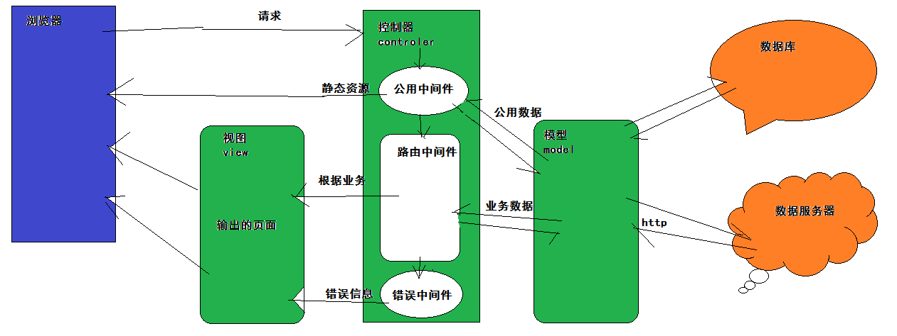

# 项目介绍

### 功能描述

- [【品优购】](https://ns.uieee.com/)前台项目，是一套比较完善的，比较贴近企业开发，注重业务逻辑的一个项目。

- 功能模块比较齐全，首页展示模块，注册模块，登录模块，商品列表模块，商品详情模块，购物车模块，个人中心模块，订单模块，收货地址模块，以前的demo项目相比有支付流程，也就是支付模块。

- 还有一些小功能，验证码功能，邮件激活功能，离线购物车功能，自动登录功能，图片懒加载功能，图片放大功能 ...

### 使用技术

- Node.js运行环境平台，使用 [express](http://www.expressjs.com.cn/) 搭建后台服务，依赖一些第三方的包：

  ```reStructuredText
  "art-template": "^4.13.0",
  "axios": "^0.18.0",
  "cookie-parser": "^1.4.3",
  "emailjs": "^2.2.0",
  "express": "^4.16.4",
  "express-art-template": "^1.0.1",
  "express-favicon": "^2.0.1",
  "express-mysql-session": "^2.1.0",
  "express-session": "^1.15.6",
  "http-error": "0.0.6",
  "morgan": "^1.9.1",
  "node-alipay-sdk": "^2.6.0",
  "node-schedule": "^1.3.1",
  "svg-captcha": "^1.3.12",
  "youch": "^2.0.10"
  ```

- 数据库使用Mysql，但是更多数据依赖是PHP接口服务，使用 [axios](https://www.kancloud.cn/yunye/axios/234845) 完成数据交互。

- 前端使用了，[sui](http://sui.taobao.org/sui/docs/gallery.html)  框架搭建，淘宝团队基于 [bootstrap](http://www.bootcss.com/) 封装。

### 项目架构





# 项目起步

### 代码管理（重要）

1.  能够建了自己的分享仓库 在github平台。

2.  能够推送代码 到自己的仓库。

3.  能够通过分支来管理项目的版本迭代。

4.  能够拉取开源项目的代码到本地。

   ***具体参考 git.md 文档。***

### 运行环境

1. 安装Node.js运行环境，安装mysql数据库。
2. 数据可以依赖外网服务器接口，但是考虑网络问题，和调试问题。
3. 本地启动接口服务器
   1. 初始化本地数据库 ，执行 newshop.sql 脚本
   2. 注意如果出现执行失败可能要修改数据库最大允许内存 
   3. `set global max_allowed_packet=1024*1024*16; `
   4. `..\pygProject\server\newshop\config\database.php ` 修改数据连接
   5. 运行 start.cmd 文件即可启动

###相关链接

- axios  https://www.kancloud.cn/yunye/axios/234845

- 语法风格   https://standardjs.com/readme-zhcn.html

- 接口文档  https://documenter.getpostman.com/view/130308/newshop/RVncfwwX

- 支付流程  https://open.alipay.com/platform/home.htm

- postman https://www.getpostman.com/apps

# 业务场景

### 首页渲染

### 商品列表

### 商品详情

### 购物车

### 登录

### 注册

### 结算与支付


