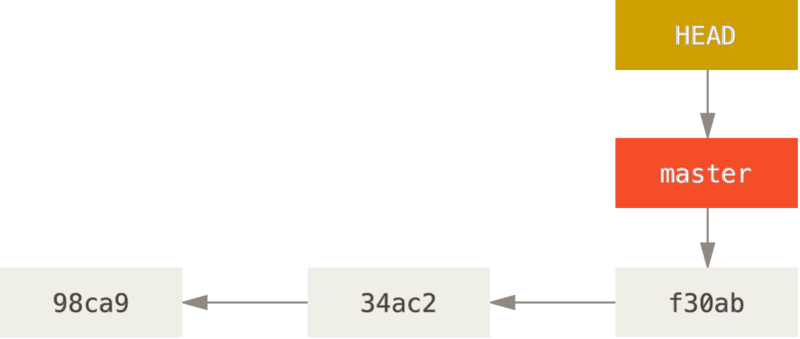
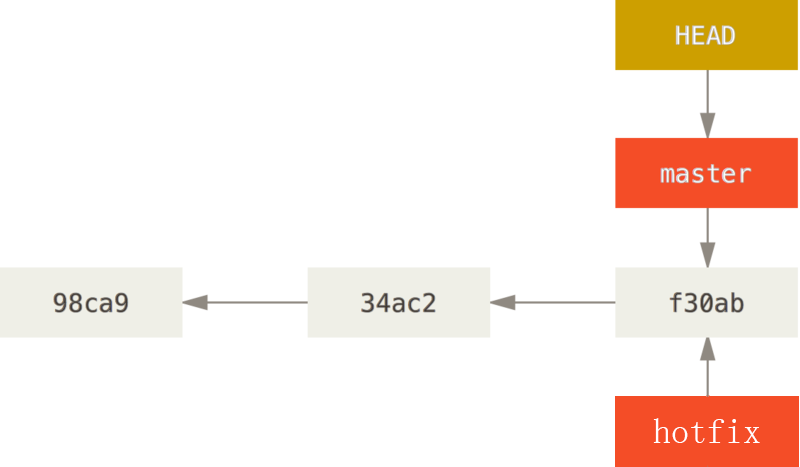
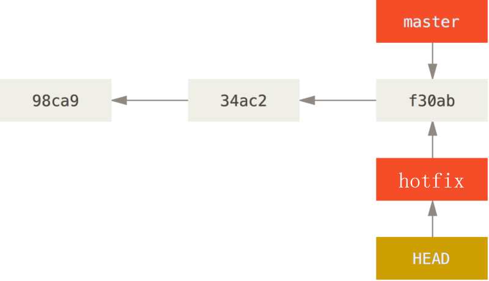
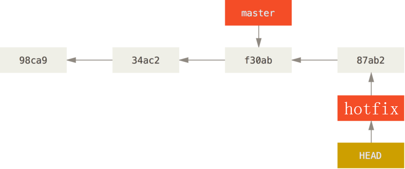
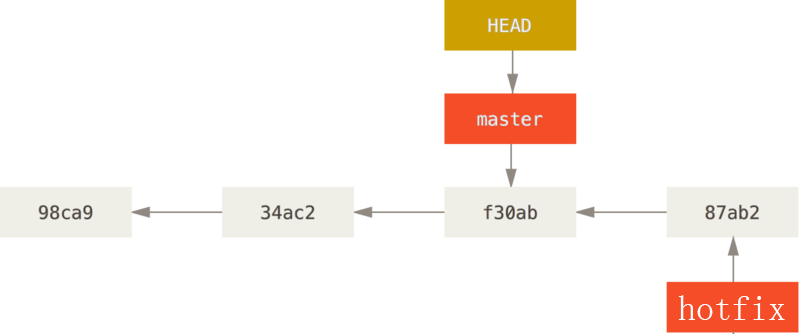
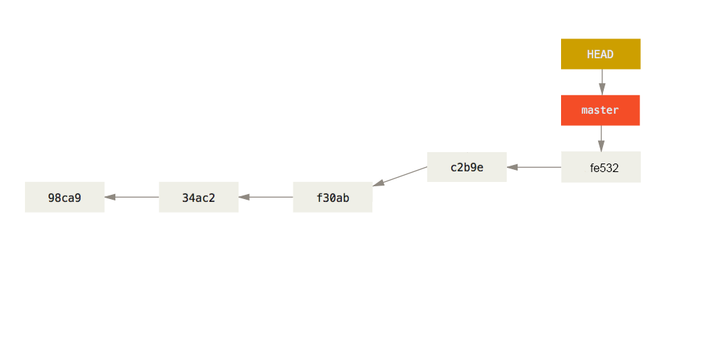

# 	git
>掌握git的常用命令操作
>能够使用代码托管平台

### 版本控制系统

##### 本地版本控制系统
借助软件我们可以记录下文件的每一次修改，如下图所示，文件被修改后，记录下了3个版本，
这样我们通过版本控制系统（软件）便可以非常方便的恢复到任意版本。如下图所示:

这种类型的版本控制系统，功能比较单一，比如很难实现多人协同开发，所以现在几乎很少使用了。

##### 集中式版本控制系统
实际开发环境，一个项目通常是由多人协作共同完成的，如何让在不同终端上的开发者协同工作成了亟待解决的问题，
集中式版本控制系统便应运而生了。它通过单一的集中管理的服务器，保存所有文件的修订版本，
协同工作的开发者都通过客户端连到这台服务器，取出最新的文件或者提交更新。其代表为SVN，如下图所示:

这种方式很好解决了多人协同开发的问题，但是也有一个弊端，如果集中管理的服务器出现故障，将会导致数据（版本）丢失的风险，
另外协同开发者从集中服务器中更新数据时，严重依赖网络，如果网络不佳，也给开发带来诸多不便。

##### 分布式版本控制系统
分布式版本控制系统，则不需要中央服务器，每个协同开发者都拥有一个完整的版本库，
这么一来，任何协同开发者用的服务器发生故障，事后都可以用其它协同开发者本地仓库恢复。
由于版本库在本地计算机，也便不再受网络影响了。如果要将本地的修改，推送给其它协同开发者，
还需要一台共享服务器，所有开发者通过这台共享服务器同步和更新数据。如下图所示:

分布式版本控制系统弥补了前面两种版本控制系统的缺陷，成为了版本控制的首选方案。其代表就是Git。

### git准备工作
##### git简介

 Git最初是在2005年由Linux之父Linus TorvaLinus领导开发的一套为Linux内核维护的版本管理系统；
 Git日臻成熟完善，在高度易用的同时，仍然保留着初期设定的目标，它的速度飞快，极其适合管理大项目；
 它还有着令人难以置信的非线性分支管理系统，可以应付各 种复杂的项目开发需求。

##### git与svn的区别

- SVN是集中式版本控制系统，版本库是集中放在中央服务器的，而干活的时候，
用的都是自己的电脑，所以首先要从中央服务器哪里得到最新的版本，然后干活，干完后，
需要把自己做完的活推送到中央服务器。集中式版本控制系统是必须联网才能工作，
如果在局域网还可以，带宽够大，速度够快，如果在互联网下，如果网速慢的话，就纳闷了。

- Git是分布式版本控制系统，那么它就没有中央服务器的，每个人的电脑就是一个完整的版本库，
这样，工作的时候就不需要联网了，因为版本都是在自己的电脑上。既然每个人的电脑都有一个完整的版本库，
那多个人如何协作呢？比如说自己在电脑上改了文件A，其他人也在电脑上改了文件A，这时，
你们两之间只需把各自的修改推送给对方，就可以互相看到对方的修改了。

##### git安装

- Window安装
    + http://git-scm.com/download/win 下载Git客户端软件，和普通软件安装方式一样。
- Linux安装
    + CentOS发行版：sudo yum install git
    + Ubuntu发行版：sudo apt-get install git
- Mac安装
    + 打开Terminal直接输入git命令，会自动提示，按提示引导安装即可。

##### git工作原理
为了更好的学习Git，我们们必须了解Git管理我们文件的3种状态，
分别是已提交（committed）、已修改（modified）和已暂存（staged），
由此引入 Git 项目的三个工作区域的概念：Git 仓库、工作目录以及暂存区域。

基本的Git工作流程如下：
1、在工作目录中修改文件。
2、暂存文件，将文件的快照放入暂存区域。
3、提交文件，找到暂存区域的文件，将快照永久性存储到Git仓库目录。

### git常见操作

##### 1.配置用户
```text
    git config --global user.name "zhoushugang"
    git config --global user.email "zhoushugang@itcast.cn"
```
配置用户的意义在于记录开发者信息，以便在版本控制记录开发者的操作行为。

##### 2.初始化仓库

**a)**需要将现有项目初始化为一个仓库：
```text
    git init
```
git init只是创建了一个名为.git的隐藏目录，这个目录就是存储我们历史版本的仓库。

**b)**已用git进行版本控制的仓库克隆到本地：
```text
    git clone git@gitee.com:zhoushugang/meituan.git
```
假如公司已有项目用了git，那我们就利用克隆，执行完这个命令，
会在当前目录下生成一个meituan目录（默认和仓库名称相同），这个便是已经使用git管理的项目。

##### 3.查看文件状态
新建文件后：已修改状态
```text
    git status
```
检测当前仓库文件的状态，注：git会忽略空的目录。

##### 4.添加文件到暂存区
```text
    //提交单个文件
    git add test.txt
    //提交单个目录文件
    git add css
    //提交所有文件
    git add .|*|-A
```
执行命令后：已暂存状态
修改文件后：已修改状态
```text
    git checkout test.txt
```
执行命令后：已暂存状态

##### 5.提交文件
将暂存区文件，全部提交到本地仓库存储。
```text
    // message 提交的备注信息
    git commit -m "message";
```
执行命令后：已提交状态

##### 6.查看提交历史
经过多次提交，查看提交历史。
```text
    git log
```

##### 7.恢复上一次提交
```text
    git reset --hard 242a
```

### git分支

在我们的现实开发中，需求往往是五花八门的，同时开发多个需求的情况十分常见，
比如当你正在专注开发一个功能时，突然有一个紧急的BUG需要你来修复，
这个时候我们当然是希望在能够保存当前任务进度，再去修改这个BUG，
等这个BUG修复完成后再继续我们的任务。如何实现呢？
**通过Git创建分支来解决实际开发中类似的问题。**

在Git的使用过程中一次提交称为历史记录（版本），并且会生成一个唯一的字符串，如下图：

当我们在初始化仓库的时候（实际上是产生第1次提交时），Git会默认帮我们创建了一个master的分支，并且有指针（HEAD）指到了末端。
指针（HEAD）用来标明当前处于哪个分支的哪个版本，如上图指的处于master分支的最后1个版本。

##### 1.创建分支 hotfix
```text
    git branch hotfix
```
新的分支会在当前分支原有历史版本的结点上进行创建，新建的子分支会继承父分支的所有提交历史，如下图:


##### 2.切换 hotfix 分支
```text
    git checkout hotfix
```
我们发现HEAD现在又指向了hotfix的末端，如下图:


##### 3.在 hotfix 修改bug
```text
    git add .
    git commit -m 'update bug'
```
这次的提交历史版本就会记录在hotfix这个分支上了，并且HEAD伴随hotfix在移动，如下图:


##### 4.切换 master 分支
```text
    git checkout master
```
当我们切换回master后，HEAD指向了master分支的末端，并且我们观察发现我们的文件内容还是原来的"模样"，如下图:


##### 5.在 master 继续开发
```text
        git add .
        git commit -m 'go on dev'
```
总结：当我们 'git checkout 分支名称'，HEAD会自动指向对应分支的末端，工作目录中的源码也会随之发生改变。
这个时候我们就在hotfix这个分支上修复了这个BUG，而我们原来在master分支上的操作并未受到影响。
但是这时的master分支并没有包含有hotfix的修复，如下图:


##### 6.合并 hotfix 分支
```text
    git merge hotfix
```
这时master会有两个父结点了，master便包含了hotfix里的修复了，如下图:


##### 6.删除 hotfix 分支
```text
    git branch -d hotfix
```
这时用来修复BUG创建的hotfix分支已经没有用处了，我们可以将它删除，如下图:



### git远程（共享）仓库
通过上面学习我们可以很好的管理本地版本控制了。
- 一种情形，可是如果我们下班回到家里突然来了灵感觉得有部分代码可以优化，
  如果能接着公司电脑上的代码继续写该有多好呀！！！
- 一种情形，假设项目比较大，不同的功能模块由不同的开发人员完成，不同模块儿之间又难免会依赖关系，
  这时如果我们的代码互相合并（融合）该有多好呀！！！

##### 1.创建共享仓库

Git要求共享仓库是一个以.git结尾的目录。

mkdir repo.git 创建以.git结尾目录

cd repo.git 进入这个目录

git init --bare 初始化一个共享仓库，也叫裸仓库 注意选项--bare

这样我们就建好了一个共享的仓库，但这时这个仓库是一个空的仓库，并且不允在这个仓库中进行任何修改。

##### 2.向共享仓库共享（同步）内容

将自已开发的项目同步到这个目录中，其它开发者就可以共享你开发的项目了。

1、进入到test目录

2、git push ../repo.git master

这样便把test中的项目同步进了repo.git中。

##### 3.从共享仓库里取出内容

1、新创建一个目录（模拟另一个开发者）

2、git clone ./repo.git demo

通过repo.git共享仓库，我们轻松得到了一个test的副本

##### 4.通过demo仓库向repo.git共享内容

进入到demo里，我们做一些修改

cd demo

git push ../repo.git master

##### 5.在仓库从repo.git获取共享的内容

cd test

git pull ../repo.git master

- 奇迹似乎发生了，我们轻松的将demo仓库里的内容，通过repo.git共享给了test仓库。
- 惊喜不断，问题也总是不断，我们发现我们这个共享的仓库只是放到了本地的，其它人是没有办法从我们这个共享仓库共享内容的！！！
- 然而现实是，办法总是有的，我们把这个共享的仓库放到一台远程服务器上，问题不就解决了吗？

##### 6.gitHub、gitLab和gitee(码云)

如果我们熟悉服务器的话，我们完全可以将上述的步骤在我们的远程服务器上进行操作，
然后再做一些登录权限的设置，就可非常完美的搭建一个共享服务器了。
其实为了更好的管理我们的仓库，一些第三方机构开发出了Web版仓库管理程序，通过Web界面形式管理仓库。

- ssh
- 简单说，SSH是一种网络协议，用于计算机之间的加密登录。如果一个用户从本地计算机，使用SSH协议登录另一台远程计算机，我们就可以认为，这种登录是安全的，即使被中途截获，密码也不会泄露。
- 配置步骤：
+ 使用git bash 执行 `ssh-keygen -t rsa `

+ 一路回车

+ 

   
